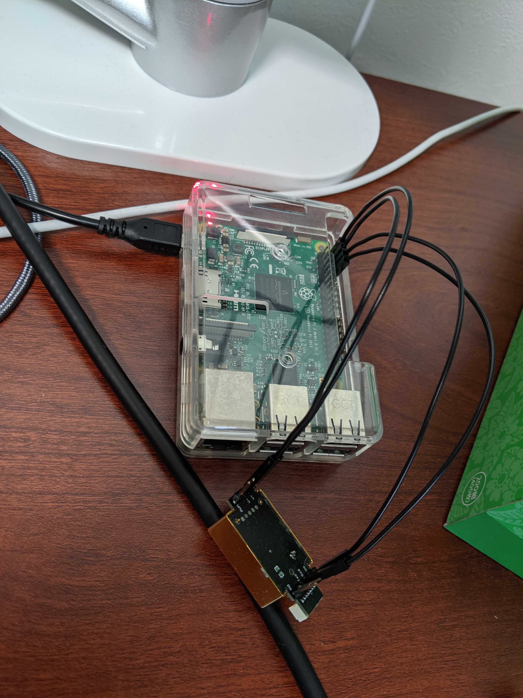
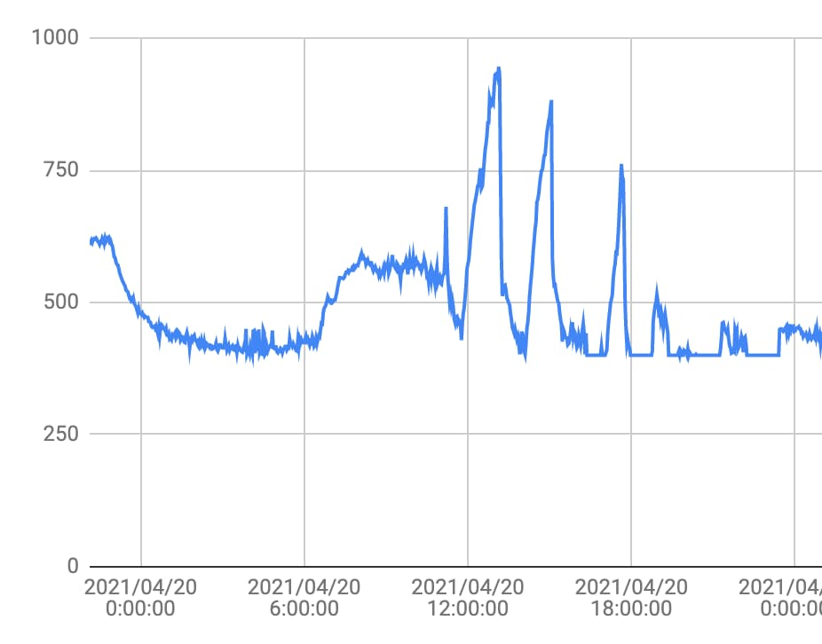

作業部屋を締め切って作業していると、息苦しくなったり頭がぼーっとしてくる時があるので二酸化炭素濃度は問題ないのかとても気になり調べてみることにしました。
電子工作でド定番の分野なので細かい作業工程とかはスキップします。
MH-Z19というCO2センサーを使って計測しました。
ちなみに今回購入したものは[フェイク品](https://tomono.tokyo/2021/01/04/9039/)だったらしく精度が悪いです...
精度は悪いですがやりたいこと（作業部屋の二酸化炭素濃度が適切かどうか判断する）に対しては十分な精度＆購入ページを見直すと精度の詳細表記もなくケチもつけづらいので手元にあるセンサーを使いました。

取り付け後はこんな感じです。
最初、はんだ付けなしでいけないか試してみましたがピンヘッダーの接触部分が少しでもずれるとセンサーから値を取れなくなるので、おとなしくはんだ付けしました。
定期的に取得してグラフにした結果が下記になります。

Y軸の単位を書き忘れていますがppmです。
作業部屋に人がいる状態でドアと窓を締め切ると急激に二酸化炭素濃度が上昇しグラフ上のスパイクが発生します。
だいたい２時間程度で1000ppmに到達します。[一般的には1000ppmを超えたら換気が必要](https://www.mio-corp.co.jp/news/ventilation-guide/#:~:text=%E4%B8%80%E8%88%AC%E7%9A%84%E3%81%AB%E4%BA%8C%E9%85%B8%E5%8C%96%E7%82%AD%E7%B4%A0,%E3%82%92%E7%9B%AE%E5%AE%89%E3%81%A8%E3%81%97%E3%81%A6%E8%80%83%E3%81%88%E3%81%BE%E3%81%99%E3%80%82)らしいです。

## 感想
仕事の日でかつ真夏or真冬の日の場合、今までほとんど換気を行わなかったために1000ppmを超えていた可能性が高いです。
今回の実装でCO2センサーから値を取得する処理は作れたので、あとは取得した結果が1000ppmだったらSlackに通知するなどの仕組みを考えれば、常に快適な環境で作業ができそうです。

## おまけ
二酸化炭素濃度のことを調べていたら、[気象庁のデータ](https://ds.data.jma.go.jp/ghg/kanshi/ghgp/co2_trend.html)を発見しました。
点々観測している二酸化炭素濃度が毎年増えていることを知って驚きました。昨今のCO2削減ブームはこのあたりの数値が要因だったりするのでしょうか。

### 参考サイト
https://www.kccs-iot.jp/20200817-technical/
http://kunsen.net/2018/08/13/post-841/