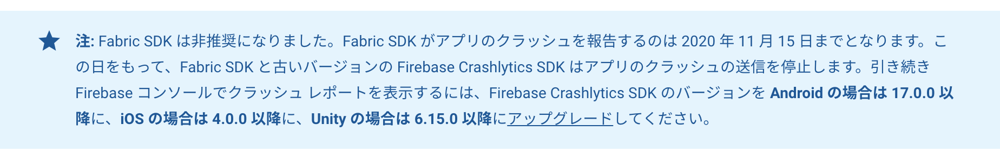

どうやらFabric製Crashlyticsが使えるのも今年の11/15までになりそうなので、Firebase製のCrashlyticsに移行してみました。

### 前提
- Fabric製Crashlyticsを現在進行形で使っている
- Firebaseとの連携が住んでいる

### TODO

[移行ドキュメント](https://firebase.google.com/docs/crashlytics/upgrade-sdk?hl=en&platform=android)を見る限り、コードの置き換えは必要なものの機械的に置き換えていけばそんなに時間掛からなそうな印象でした。
また、移行ドキュメントの日本語訳がまだないようなので英語で確認する必要がありました。
TODOは下記。

1. SDKの入れ替え
2. Applicationクラスの書き換え
3. Crashlyticsクラスを使ってる箇所の書き換え

それぞれ詳しく見ていきましょう。

#### 1. SDKの入れ替え
https://firebase.google.com/docs/crashlytics/upgrade-sdk?hl=en&platform=android#add-crashlytics-sdk

ルートディレクトリとappディレクトリ内にある`build.gradle`をいじります。
当たり前ですが、この修正以降全てのTODOが完了するまでビルドが通らなくなります。

#### 2. Applicationクラスの書き換え
https://firebase.google.com/docs/crashlytics/upgrade-sdk?hl=en&platform=android#fabric_sdk_2

Crashlyticsの初期化処理を書き換えます。
Fabric API keyは不要になりますので`AndroidManifest.xml`から削除しておきましょう。

#### 3. Crashlyticsクラスを使ってる箇所の書き換え
https://firebase.google.com/docs/crashlytics/upgrade-sdk?hl=en&platform=android#the_new_package_and_classname_for_is_comgooglefirebasecrashlyticsfirebasecrashlytics

コード上の各所で使われていて影響範囲は広かったのですが、機械的に直せそうだったので下記のような一括置換を行いました。

**インポート文修正**
```
// Before
import com.crashlytics.android.Crashlytics

// After
import com.google.firebase.crashlytics.FirebaseCrashlytics
```

**インスタンスの取得方法変更**

```
// Before
Crashlytics.log()

// After
FirebaseCrashlytics.getInstance().log()
```

後は動作確認して終わり。