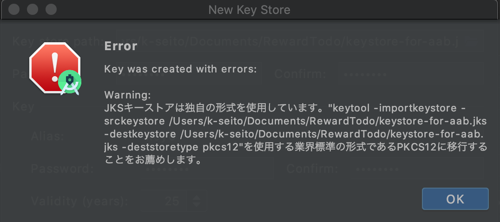

Android StudioでApp Bundleの挙動を確かめるために、Google Playアップロード用の署名鍵を作成したものの、
ちょっと心配になる挙動があったのでメモとして残します。

## 作業環境
- macOS Catalina Ver.10.15.6
- Android Studio 4.1

## 署名鍵を作る
Android Studioで新しく署名鍵を作る時は下記の手順になります。
1. Build -> Generate Signed Bundle/APK を選択
2. Android App Bundle を選択
3. Create new... を選択
4. 必要事項を記入
5. OKボタンを押す

今回、新しく鍵を作成したところ、手順5の後に下記のようなダイアログが表示されました。

エラー内容的には、`JKSで署名鍵作ってるけど業界標準はPKCS12だからそっち使ってね`という内容です。（素直にこの指示に従いCLIで署名鍵の書き換えを行ったらエラーが出て置き換えできませんでした。）
個人的には、このエラーと共に生成された鍵を信用して良いのかだいぶ心配だったので調査してみました。

## 調査結果
結論として、主に下記３点を確認しましたが、生成された鍵自体は何も問題ありませんでした。
- 生成された署名鍵でアプリに署名できる
- 署名されたAABファイルをストアにアップロードできる
- クローズドベータテストでアプリを配布して任意のAndroidデバイスから起動できる

また、調査する中で下記のような情報を発見しました。
- https://penpen-dev.com/android/252-2/
- https://androidaps.readthedocs.io/en/latest/EN/Installing-AndroidAPS/troubleshooting_androidstudio.html#key-was-created-with-errors
- https://issuetracker.google.com/issues/147481893

上記情報を踏まえての推測になりますが、Android Studioの署名鍵作成時は警告などのログを表示する場所がないために、生成後に表示するエラーに雑にまとめて表示されてるのかなと思いました。