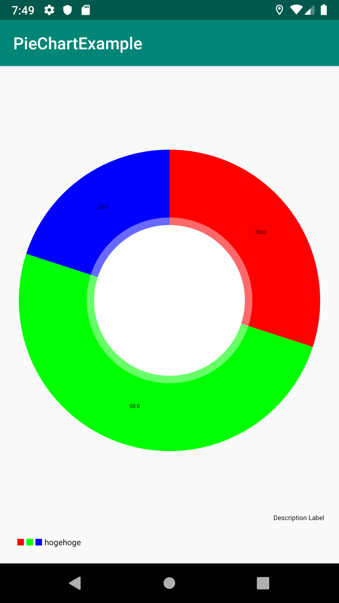
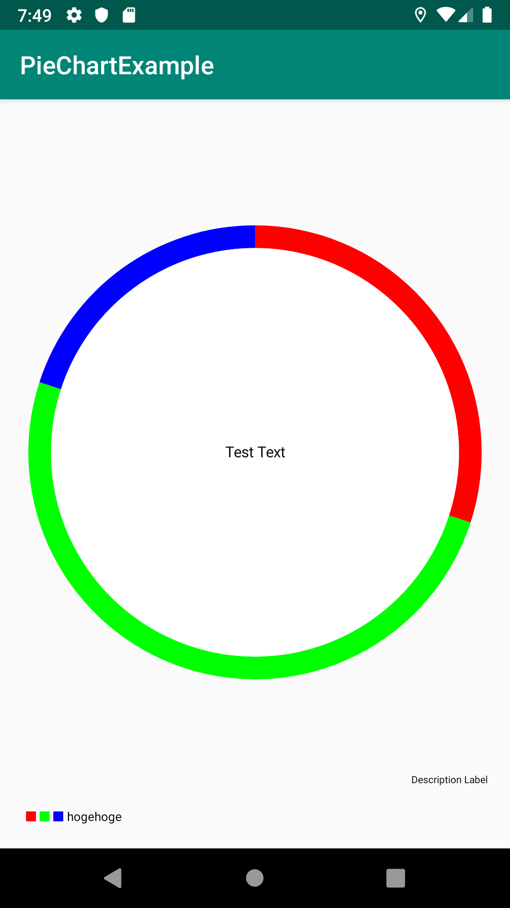

## はじめに
仕事で[MPAndroidChart](https://github.com/PhilJay/MPAndroidChart)の`PieChart`を使う機会があったのですが、カスタマイズが思いの外時間がかかったのでメモを残しておきます。
`PieChart`は円グラフを表示するUIコンポーネントで、細かな制御が色々できて便利なのですが、メソッド名が直感的ではなく結局ソースコードを読んでどのプロパティを変更すれば期待した動作になるか調査しながら進めました。

## やりたかったこと
まずはじめに、デフォルトの`PieChart`を表示すると下図のようになります。



この図に対して下記3点の変更を加えました。
- 円グラフの太さを変更
- テキストを中央に配置する
- 円グラフの中に表示されてる数値を削除する

### 円グラフの太さを変更
`PieChart`の内部では、まず穴なしの円を書いた後にその円をくり貫くような実装をしています。
なので円グラフの太さを変更したい場合はくり抜く円の半径を調整すれば良いです。

```
pieChart.holeRadius = 90f
```

元の円の何パーセントをくり抜くかというプロパティを変更することで実現できます。デフォルト５０％なので９０％にすると細くなります。

### テキストを中央に配置する
円グラフの中央にテキストを配置するということはよくあると思います。
`PieChart`とは別にビューを作れば良いだけではありますが`PieChart`自身も中央にテキストを配置する機能を持っています。

```
pieChart.centerText = "Test Text"
```

テキストカラー・サイズを変更するメソッドも生えてるので安心です。

### 円グラフの中に表示されてる数値を削除する
これが一番ハマりました。この数値を消すには`PieChart`ではなく`PieDataSet`のプロパティを変更する必要があります。

```
dataSet.setDrawValues(false)
```

`PieDataSet`が内部に持つ`mDrawValues`を`false`にすることでデータを描画するときに数値を表示しないようにできます。

上記３つのプロパティを全て変更すると下図のようなグラフになります。



## 参考サイト
https://github.com/PhilJay/MPAndroidChart
https://weeklycoding.com/mpandroidchart-documentation/